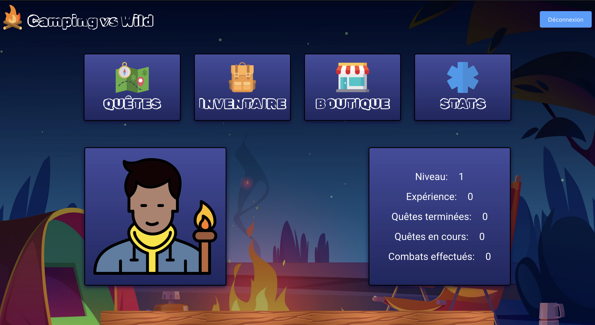
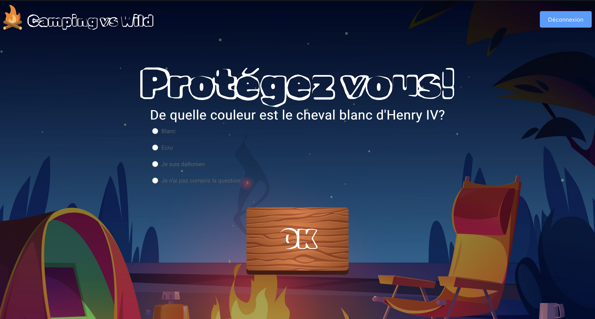
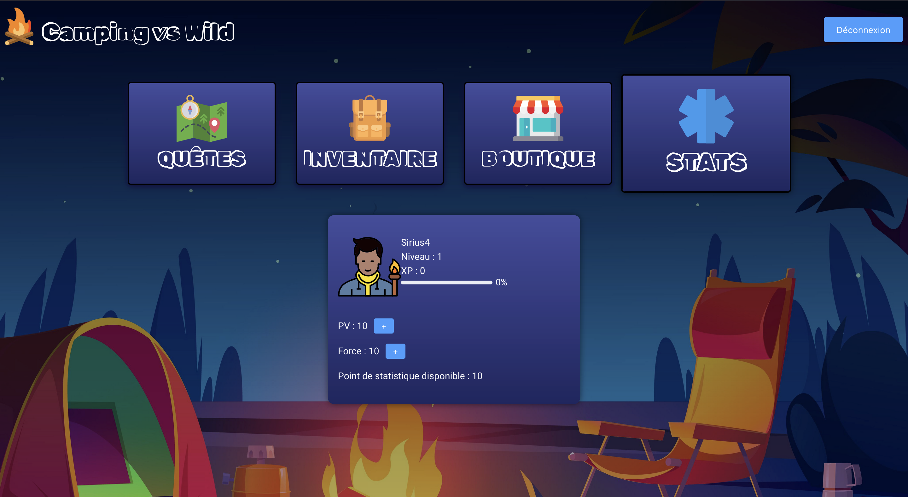
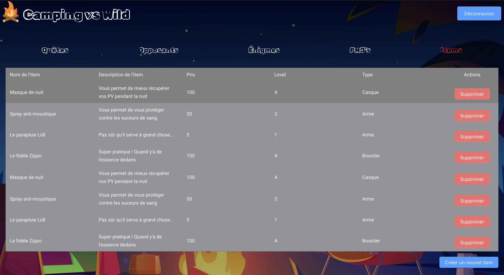
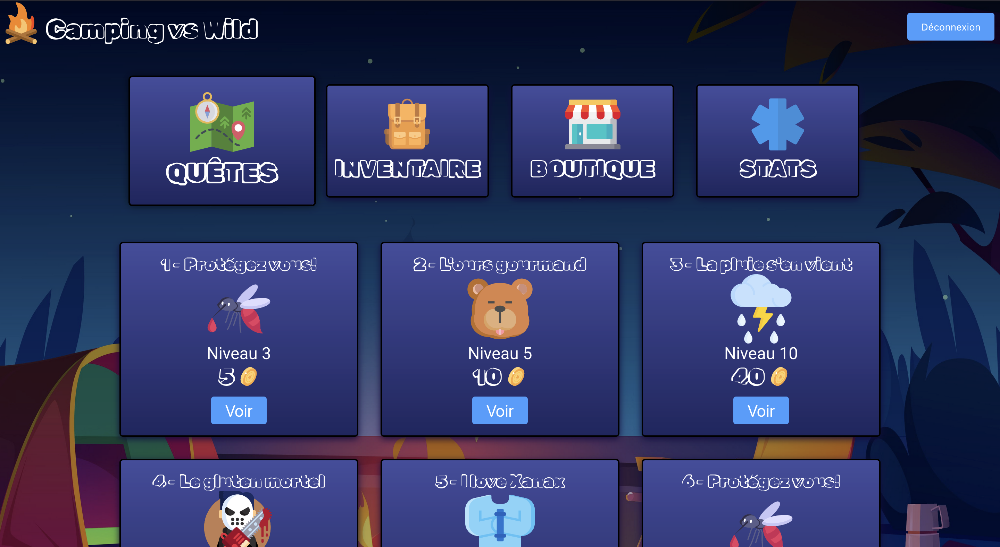
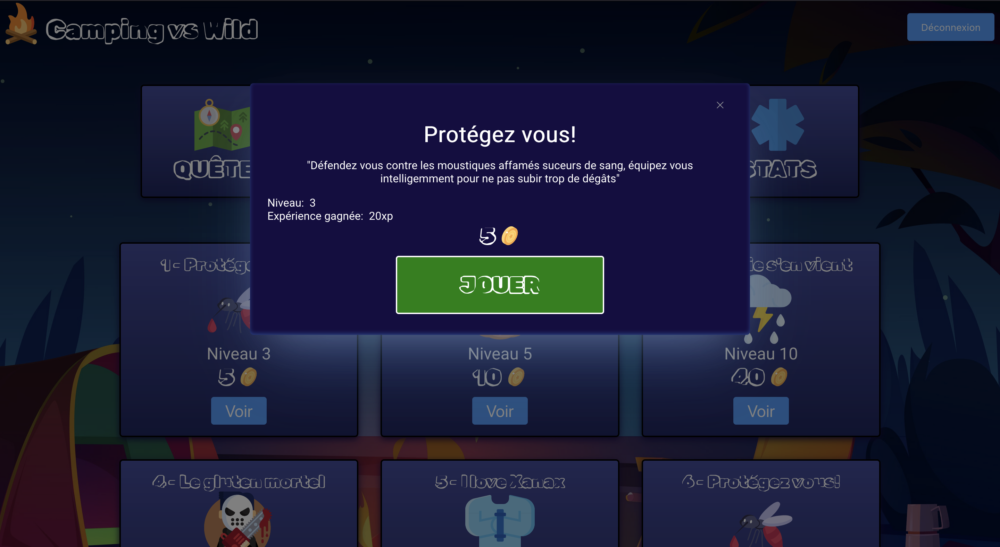

# RPG-Game

      
     
     
     
     

Projet de jeu RPG fait en Ruby On Rails / Vue 3 en collaboration avec mon binôme ultime, j'ai nommé <a href="https://github.com/CorentinNrd/CorentinNrd">Corentin</a>.

Nous avons divisé le travail en deux, lui s'est principalement occupé du back-end et moi du front-end. Cela m'a permis de m'initier à des outils tels que Pinia et ElementPlus.

<h2>Fun fact</h2>

Nous avions un délais imposé par l'école, d'une semaine pour compléter ce projet (en parallèle de nos alternances), il n'est malheureusement pas terminé. Cependant, je suis personnellement persuadée que le but n'était pas de proposer un RPG complet mais plutôt de construire une API "from scratch" et d'explorer Ruby On Rails et SQLite.

<h2>Côté tech</h2>

Pour installer ce projet et lancer les différents serveurs, rendez vous dans les dossiers <code>client</code> et <code>api</code> qui disposent chacun d'un ReadMe très bien documenté pour vous aider à tout mettre en place.

<h2>Image du jeu</h2>

     <table>
          <tr>
               <td></td>
               <td></td>
               <td></td>
          </tr>
          <tr>
               <td></td>
               <td></td>
               <td></td>
               <td></td>
          </tr>
     </table>

